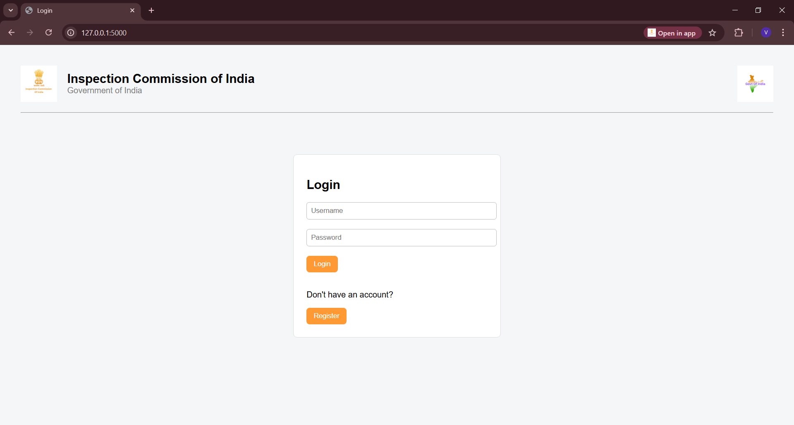
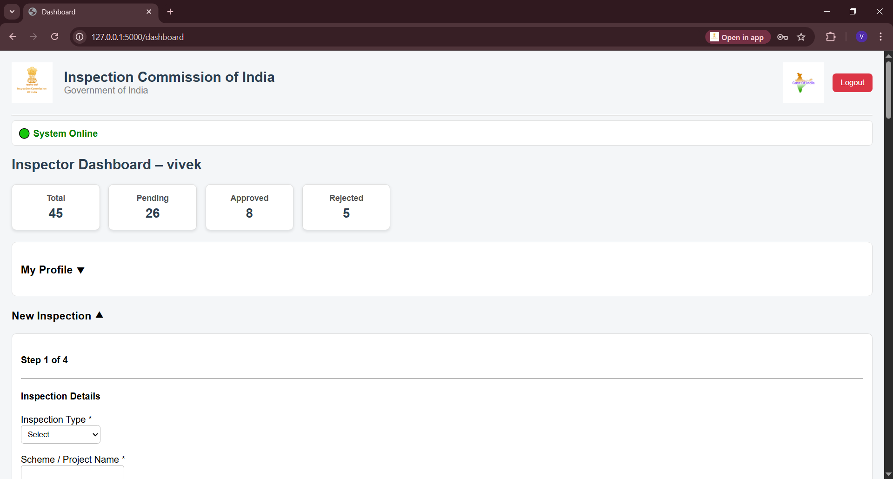
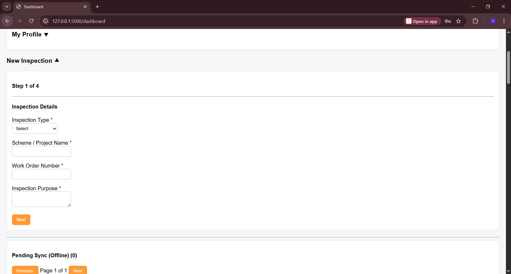
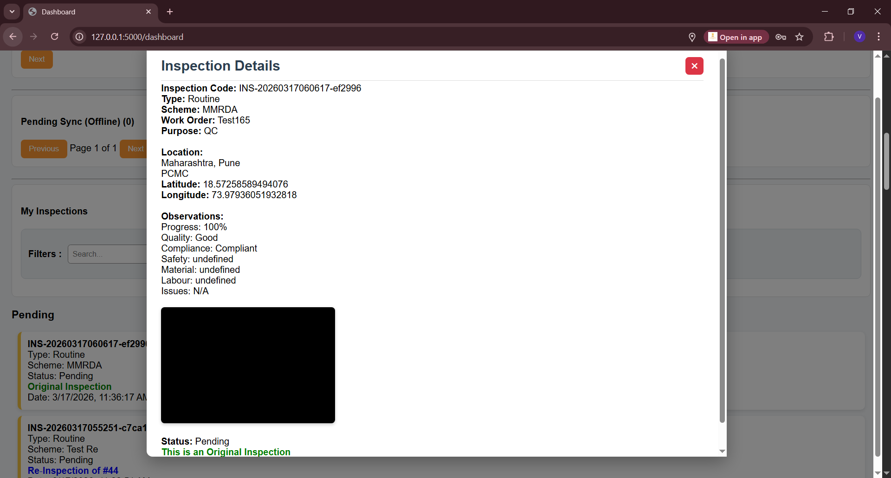
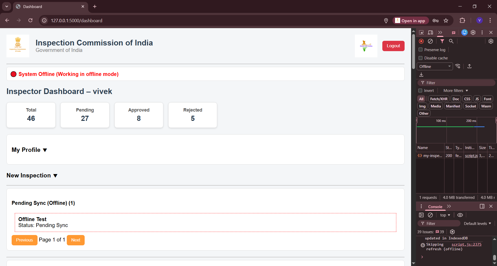
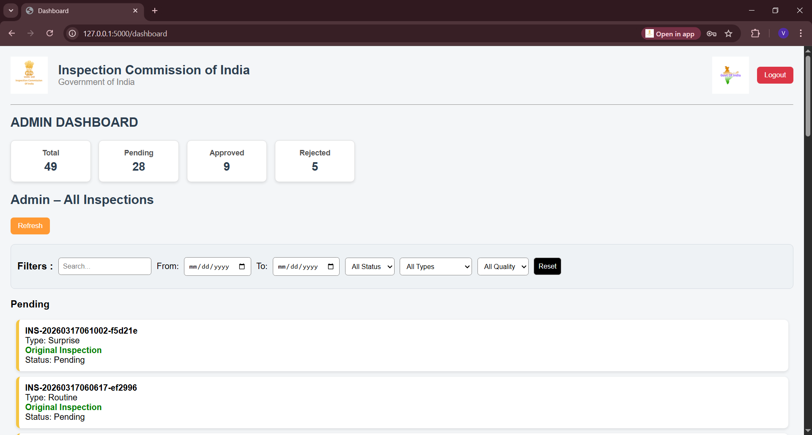
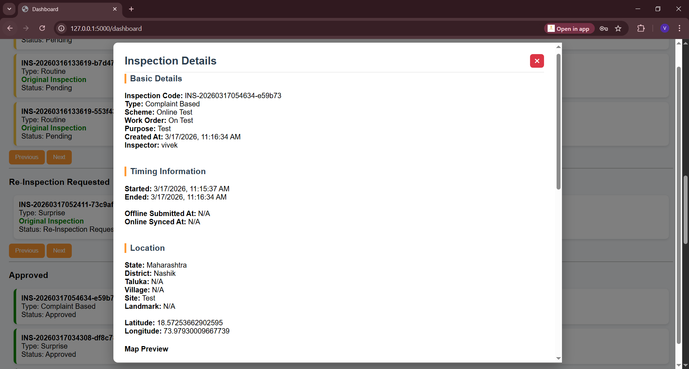
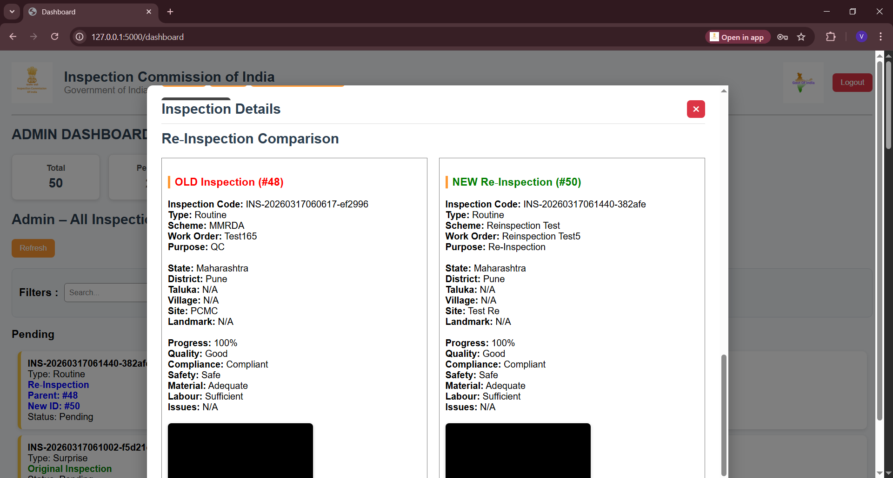
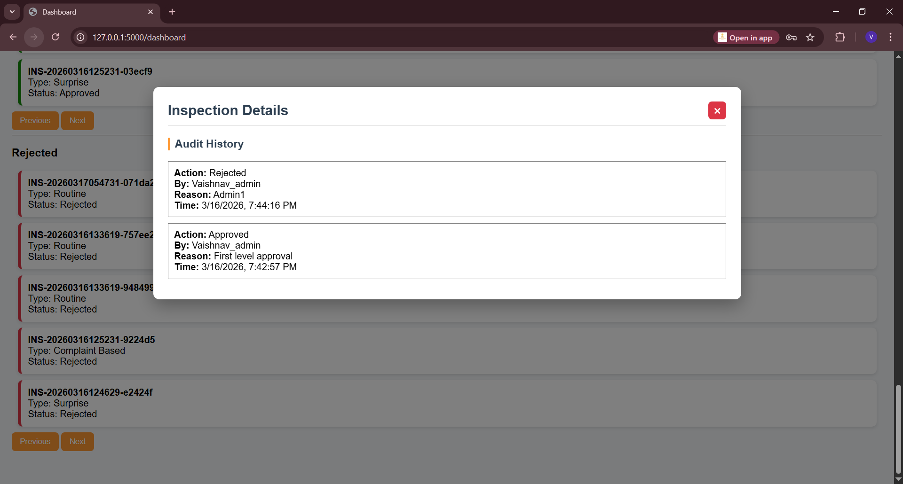

<p align="center">
  <h1 align="center">📋 Offline‑First Field Inspection PWA</h1>
  <p align="center">
    Progressive Web Application for Field Inspections with Offline Support, Admin Workflow, and Audit Logging
  </p>
</p>

<p align="center">
  
  
  
  
  
</p>

---

# 📋 Offline‑First Field Inspection PWA

**Offline‑First Field Inspection PWA** is a Progressive Web Application designed to enable inspectors to perform **field inspections even without internet connectivity**.

The system stores inspection data locally using **IndexedDB** and automatically synchronizes with the backend server once internet connectivity is restored.

It provides a complete workflow including:
- Inspection submission  
- Admin approval / rejection  
- Re‑inspection requests  
- Audit history tracking  

This system is ideal for:
- Government inspections  
- Infrastructure monitoring  
- Compliance audits  
- Field reporting systems  

---

# 🎯 Objective

The goal of this project is to build a **reliable field inspection platform** that can:

- Allow inspectors to submit reports from remote locations  
- Capture **photo evidence and GPS location**  
- Work **offline in low connectivity environments**  
- Automatically **sync inspection data when network returns**  
- Provide administrators tools to **review and manage inspections**  
- Maintain a **transparent audit trail of decisions**  

---

# 🧩 Features

### 📶 Offline‑First Architecture
- Uses **IndexedDB** for local storage  
- Automatic sync when internet is restored  

### 📷 Camera & GPS Capture
- Capture photo evidence  
- Store **latitude & longitude**

### 📝 Multi‑Step Inspection Form
1. Inspection details  
2. Location details  
3. Observation details  
4. Photo & declaration  

### 👨‍💼 Role‑Based Access Control

#### Inspector
- Submit inspections  
- Work offline  
- View inspection status  

#### Admin
- Review all inspections  
- Approve / reject  
- Request re‑inspection  
- View audit history  

### 🔁 Re‑Inspection Workflow
- Admin requests re‑inspection  
- Inspector submits follow-up  
- Parent-child comparison  

### 📊 Dashboard
- Real-time stats  
- Pagination support  
- Filters (Admin)  

### 📜 Audit Logging
- Tracks all admin actions  
- Includes:
  - Action  
  - Reason  
  - User  
  - Timestamp  

### 📍 Map Preview
- Displays inspection location using **Google Maps**

### 📱 Progressive Web App (PWA)
- Installable  
- Offline capable  
- Service Worker enabled  

---

# 🧠 How It Works

1. Inspector logs in  
2. Creates inspection via multi-step form  
3. Captures photo + GPS  
4. If offline → stored in IndexedDB  
5. When online → auto-sync to server  
6. Admin reviews inspection:
   - Approve  
   - Reject  
   - Request re‑inspection  
7. All actions stored in audit logs  

---

# 📸 Screenshots

## 🔐 Login Page


## 👨‍🔧 Inspector Dashboard


## 📝 Inspection Form


## 📷 Camera & GPS Capture


## 📶 Offline Mode


## 👨‍💼 Admin Dashboard


## 📋 Inspection Details


## 🔁 Re‑Inspection Comparison


## 📜 Audit History


---

# 🧰 Technologies Used

| Category | Tools / Libraries |
|--------|----------------|
| **Backend** | Flask |
| **Database** | SQLite |
| **Frontend** | HTML, CSS, JavaScript |
| **Offline Storage** | IndexedDB |
| **PWA** | Service Workers, Web Manifest |
| **Authentication** | JWT |
| **Location API** | Browser Geolocation |
| **Camera API** | MediaDevices API |
| **Maps** | Google Maps Embed |
| **Environment** | Python Virtual Environment |

---

# ⚡ Quick Start
```bash
git clone https://github.com/VS7001/Offline-First-Field-Inspection-PWA.git
cd Offline-First-Field-Inspection-PWA
```
```bash
python -m venv .projectvenv
.projectvenv\Scripts\activate
```
```bash
pip install -r requirements.txt
```
```bash
cd inspection-management-system
```
```bash
python app.py
```
---
👉 Open in browser:
```bash
http://127.0.0.1:5000
```
---
⚙️ How to Run:

1️⃣ Clone Repository
```bash
git clone https://github.com/VS7001/Offline-First-Field-Inspection-PWA.git
```
2️⃣ Navigate
```bash
cd Offline-First-Field-Inspection-PWA
```
3️⃣ Create Virtual Environment
```bash
python -m venv .projectvenv
.projectvenv\Scripts\activate
```
4️⃣ Install Dependencies
```bash
pip install -r requirements.txt
```
5️⃣ Run Application
```bash
cd inspection-management-system
python app.py
```
6️⃣ Open Browser
```bash
http://127.0.0.1:5000
```
---
```bash
📦 Project StructureOffline-First-Field-Inspection-PWA
│
├── inspection-management-system
│ ├── routes
│ │ ├── auth.py
│ │ └── inspection.py
│ │
│ ├── static
│ │ ├── icons
│ │ ├── script.js
│ │ ├── service-worker.js
│ │ └── manifest.json
│ │
│ ├── templates
│ │ ├── index.html
│ │ ├── register.html
│ │ └── dashboard.html
│ │
│ ├── app.py
│ ├── config.py
│ ├── models.py
│ ├── extensions.py
│ └── utils.py
│
├── screenshots
├── requirements.txt
└── README.md
```
---
🚀 Future Improvements:

1. Mobile UI enhancements
2. Image compression
3. Cloud database (PostgreSQL / Firebase)
4. Analytics dashboard
5. Multi-department support
6. Super Admin role
---
🌐 Deployment
Can be deployed on:
1. Render
2. Railway
3. AWS
4. DigitalOcean
---
👨‍💻 Author
**Vivek S Suryawanshi**

GitHub: https://github.com/VS7001
